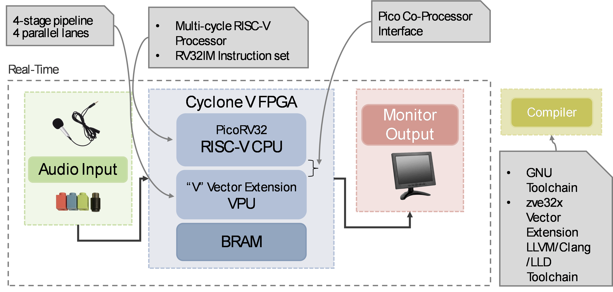
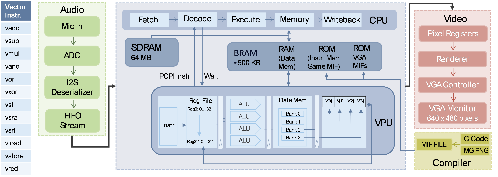

# BuckBuckGo – Accelerated Soft‑Core Game Platform
<p align="center">
  
</p>


* **BuckBuckGo** is an audio‑driven, Flappy‑Bird‑style game that demonstrates how a lightweight RISC‑V CPU plus a custom Vector Processing Unit (VPU) can deliver real‑time graphics, audio, and physics on the **Terasic DE1‑SoC** FPGA board.
[Website](https://msadmansakib.github.io/ECE554-Team3-SpeakEasy/index.html)
---

## Table of Contents

1. [Project Overview](#project-overview)
2. [System Architecture](#system-architecture)
3. [Hardware Platform](#hardware-platform)
4. [Repository Layout](#repository-layout)
5. [Demo](#demo)
6. [Contributors](#contributors)
7. [Future Work](#future-work)
8. [License](#license)

---

## Project Overview

* **Soft‑core CPU:** [PicoRV32](https://github.com/YosysHQ/picorv32) configured as RV32IMC
* **VPU:** Custom 4‑lane, 32‑bit Vector Processing Unit implementing a subset of the RISC‑V Vector Extension (RVV **Zve32x**).
* **Real‑time audio:** WM8731 codec over I²S → FIFO → CPU/VPU for gameplay control.
* **Graphics pipeline:** 640 × 480 @ 60 Hz VGA output, sprite ROMs stored in MIF/HEX, rendered entirely on‑chip.
* **Programming model:** Bare‑metal C with custom intrinsics (`vadd.vv`, `vld.v`, etc.) compiled using the RISC‑V GCC toolchain.
* **Target board:** Terasic DE1‑SoC Cyclone V (5CSEMA5F31C6), using on‑chip BRAM and 64 MB SDRAM.

The result is a self‑contained arcade game—complete with scrolling background, animated Bucky Badger sprite, and audio‑triggered events—running on a **single FPGA bitstream** and less than 64 KB of code.

## System Architecture

> **System Block Diagram**
<p align="center">
  
</p>

>  **Microarchitecture Diagram**
<p align="center">
  
</p>


* **CPU ↔ VPU:** PCPI coprocessor interface with ready/valid handshake.
* **Memory map:** BRAM for code/data, SDRAM for large sprite frames and audio buffers.
* **Toolchain:** Quartus Prime 22.1 Std, ModelSim, RISC‑V GCC 13.

## Hardware Platform

| Resource       | Utilisation               |
| -------------- | ------------------------- |
| Logic Elements | \~48 k / 85 k             |
| BRAM           | 79%                       |
| On‑chip DSP    | 10 / 87                   |


## Repository Layout

```
├── src/               # Verilog / SystemVerilog source files
│   ├── cpu/           # PicoRV32 + PCPI wrapper
│   ├── vpu/           # Vector Processing Unit
├── IPs/               # Custom Altera IPs for ROM, RAM, VGA, Audio Codec, Output I/O
├── mifs/              # MIF/HEX memory‑initialisation files (sprites, fonts)
├── qsys/              # Platform Designer system
├── project_files/     # Quartus project (*.qsf, *.qpf)
├── images/            # Sprite Images
└── README.md          # You are here
```

## Demo

Watch a short hardware walk‑through and gameplay clip [here](https://msadmansakib.github.io/ECE554-Team3-SpeakEasy/doc/demo.html).

## Contributors

* **M. Sadman Sakib** – Memory controller, VPU, system integration
* **Rohan Rao** – VPU design, code integration, graphics
* **Aditi Shah** – CPU bring‑up, audio subsystem
* **Asish Das** – Software tooling, speech‑to‑text exploration

See the [team page](https://msadmansakib.github.io/ECE554-Team3-SpeakEasy/doc/team.html) for full bios.

## Future Work

* Quantise & offload an on‑device **speech‑to‑text** model (Tiny‑TFLite) onto the VPU.
* Increase VPU width to **8 lanes** and add strided memory operations.
* DMA‑based streaming from SDRAM to reduce BRAM footprint.
* Port the design to a popular standalone **Max 10** or **Artix‑7** boards.

## License

This project is licensed under the **MIT License** – see `LICENSE` for details.
